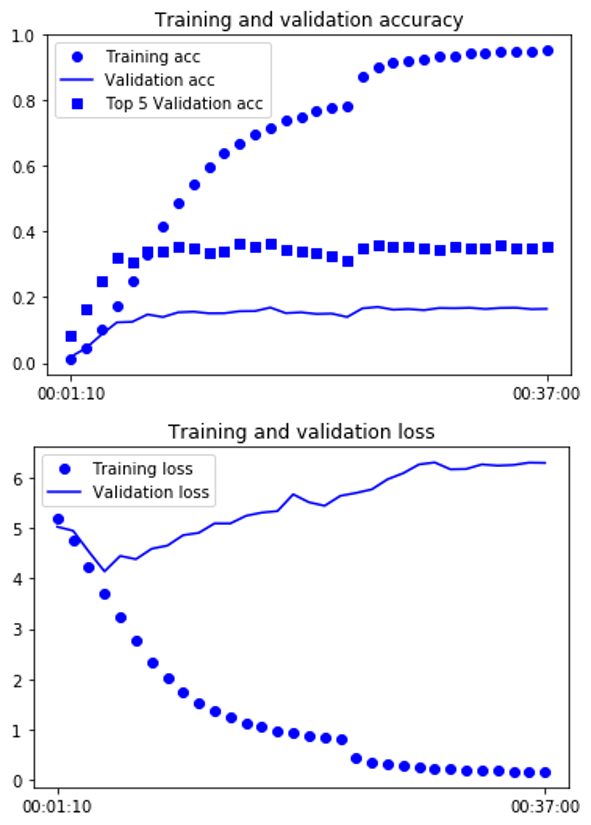
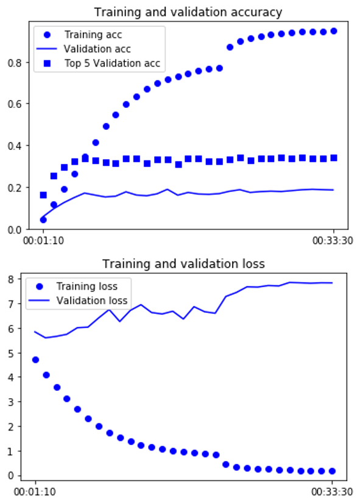

# specialized-neural-network
- experiment for [Tiny Imagenet](https://tiny-imagenet.herokuapp.com/)
```
1. Learning full model 
2. Dividing k clustering(k-means)
3. Learning model to k cluster sperately
4. Comparing 2 model
```
**Full Model training**  


**Both Reduced Model training**  


**Both Reduced Model training (clusterd data)**  

