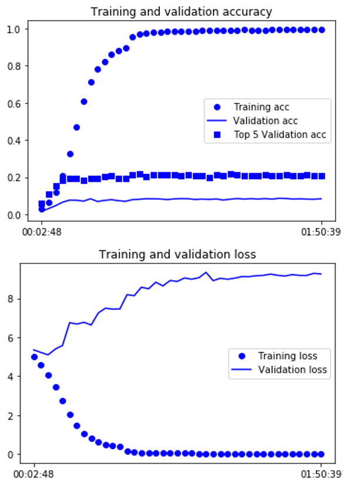

# specialized-neural-network
- experiment for cifar-10
```
1. Learning full model 
2. Dividing k clustering(k-means)
3. Learning model to k cluster sperately
4. Comparing 2 model
```
**full model training** 

